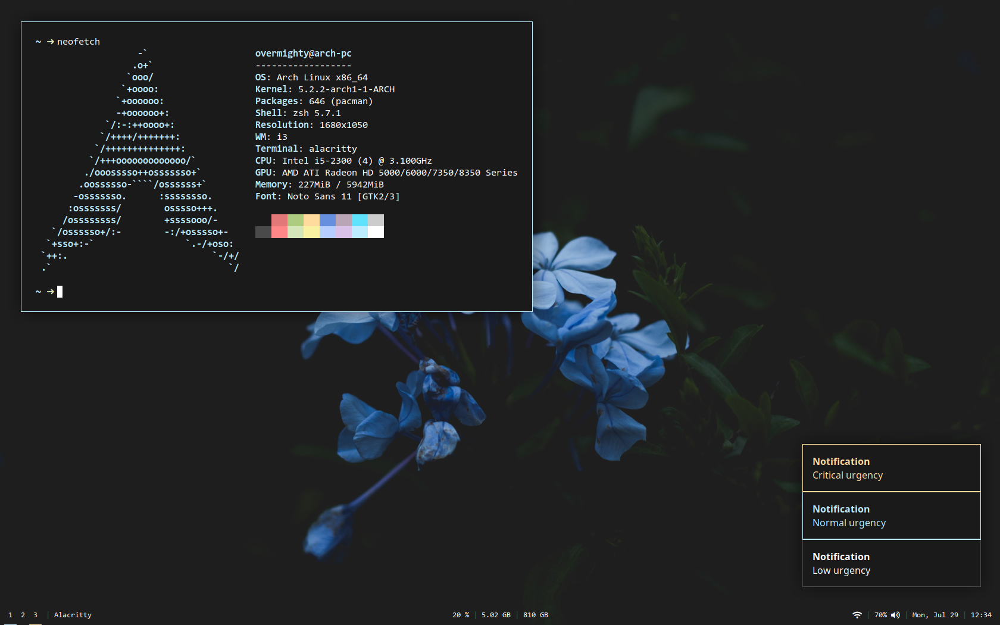

    <h1>Dotfiles</h1>
    <blockquote>
        
OverMighty's Arch Linux dotfiles.

    </blockquote>

## Details

**Window manager:** [i3-gaps](https://github.com/Airblader/i3)  
**Bar:** [Polybar](https://github.com/polybar/polybar)  
**App launcher:** [Rofi](https://github.com/davatorium/rofi)  
**Shell:** [Zsh](https://github.com/zsh-users/zsh)  
**Terminal emulator:** [Alacritty](https://github.com/jwilm/alacritty)  
**Notifications:** [Dunst](https://github.com/dunst-project/dunst)  
**Primary code editor:** [Visual Studio Code](https://github.com/microsoft/vscode)  
**Cursor theme:** [Capitaine cursors](https://github.com/keeferrourke/capitaine-cursors)  
[**Wallpaper**](https://images.unsplash.com/photo-1511108988782-9a5c10cbc062)

## Screenshots

