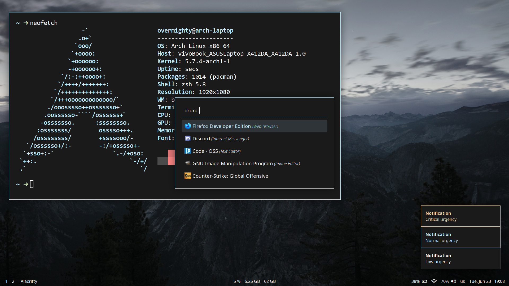
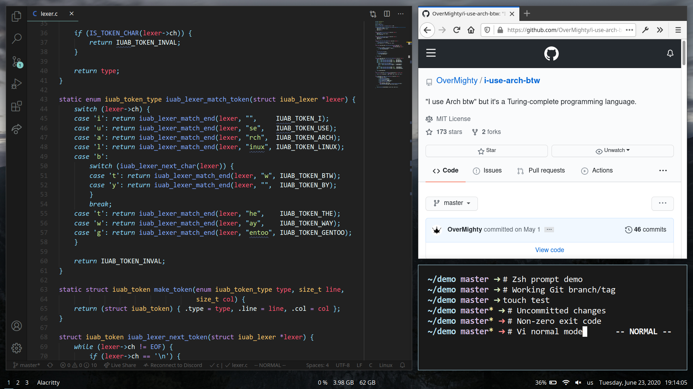

<div align="center">
    <h1>Dotfiles</h1>
    <blockquote>
        <p>OverMighty's Arch Linux dotfiles.</p>
    </blockquote>
</div>



## Installation

You can use [GNU Stow](https://www.gnu.org/software/stow/) to install the
dotfiles contained in this repository. Simply `cd` into your clone of this
repository and run the following command:

```
$ stow --target="$HOME" --no-folding .
```

By default, GNU Stow symlinks directories that don't exist in the target
directory, but with the `--no-folding` flag, GNU Stow will *create* those
directories in your home directory, and only symlink actual files.

## Details

#### Graphical environment

- Window manager: [i3-gaps](https://github.com/Airblader/i3)
- Compositor: [picom](https://github.com/yshui/picom)
- Bar: [Polybar](https://github.com/polybar/polybar)
- Notification daemon: [Dunst](https://github.com/dunst-project/dunst)
- App launcher: [Rofi](https://github.com/davatorium/rofi)
- Screen locker: [i3lock-color](https://github.com/PandorasFox/i3lock-color)

#### Command-line

- Shell: [Zsh](https://github.com/zsh-users/zsh)
- Terminal emulator: [Alacritty](https://github.com/jwilm/alacritty)

#### Development environment

- Primary code editor: [Visual Studio Code](https://github.com/microsoft/vscode)
- Secondary code editor: [Neovim](https://github.com/neovim/neovim)
- Java IDE: [IntelliJ IDEA Community Edition](https://github.com/JetBrains/intellij-community)

#### Miscellaneous

- Web browser: [Firefox Developer Edition](https://www.mozilla.org/en-US/firefox/developer/)
- File manager: [ranger](https://github.com/ranger/ranger)
- Document viewer: [zathura](https://github.com/pwmt/zathura)
- Video player: [mpv](https://github.com/mpv-player/mpv)
- Screenshot tool: [Flameshot](https://github.com/lupoDharkael/flameshot)

#### Theme

- GTK theme: [Materia](https://github.com/nana-4/materia-theme)
- Cursor theme: [Capitaine cursors](https://github.com/keeferrourke/capitaine-cursors)
- [Wallpaper](https://unsplash.com/photos/ybw-0_Hfk1I)


